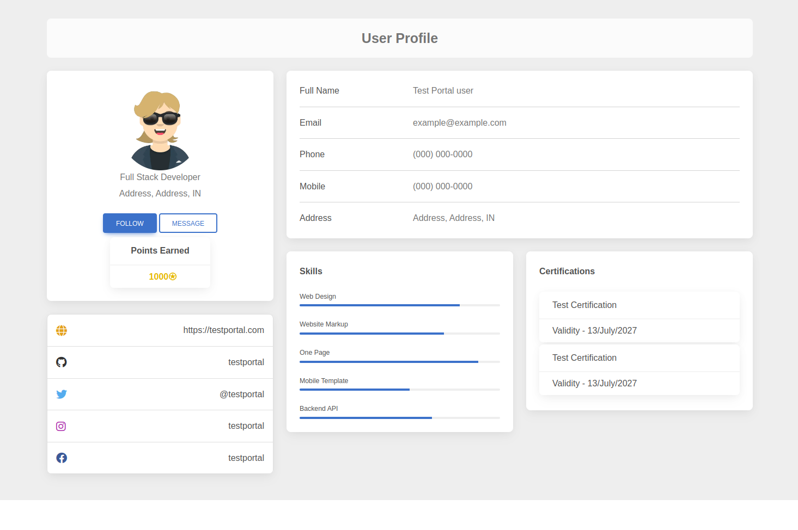

# react-profile-page

## Description

This is a sample project for React Profile page template

1. React bootstrap
2. React router dom
3. Recoil for statemanagement
4. Routing implemented in App.jsx
5. Axios for API
6. Hooks for Private route, Axios client
7. Ag-Grid for Tables
8. React alerts
9. Styled components
10. Tailwind CSS

## Installation and running the project

Install all the dependecies - npm install

Launch the project in local - npm run dev

## Sample profile page image

